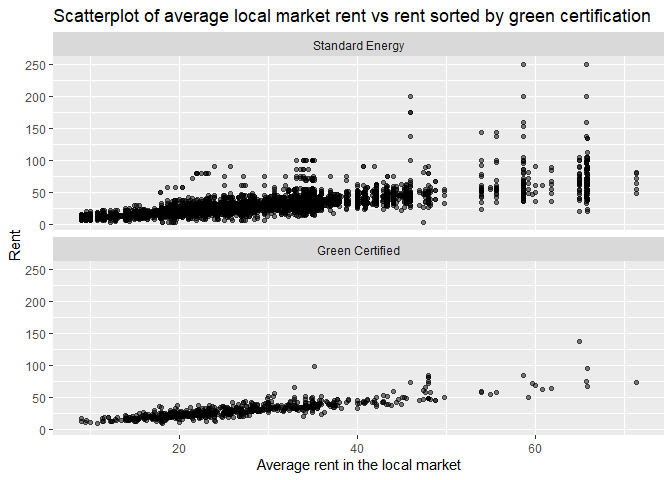
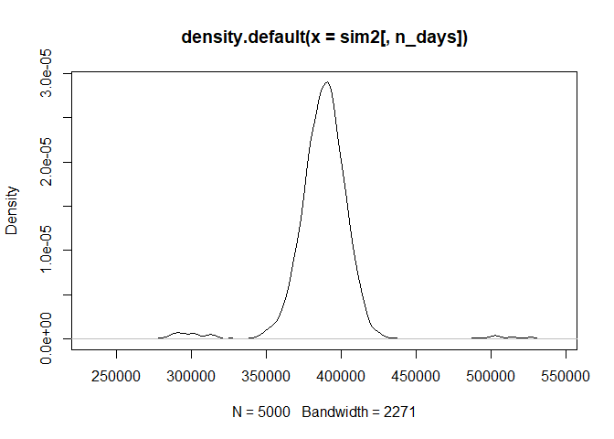
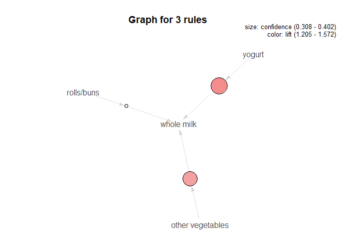

STA380\_exercises
=================

This github repistory contains our solutions to the predictive modeling
part 2 exercises for the MSBA program at UT Austin.

\#Authors - Matthew Leong  
- Chirag Ramesh  
- Grayson Taylor  
- Paridhi Sheth

Problem 1: Visual story telling part 1: green buildings
-------------------------------------------------------

There were a number of things that sounded off about the “Excel guru”’s
analysis but first, we wanted to check if there was an unacceptable
amount of data lost.

    ## The original dataset originally had 7894 observations.

    ## The new cleaned dataset has 7679 observations.

    ## They differ by 215 observations

    ## which is a percentage difference of 2.723588 percent.

    ## There are 684 green certified buildings in the data set.

    ## There are 6995 non green certified buildings in the data set.

After running some code really quickly, we can see that the guru lost
about 2.72% of the data which is honestly an acceptable amount. As such,
we will also be using this subset of the data for our plots. However,
the guru’s analysis falls apart because he forgot to consider other
variables. To demonstrate this issue, let’s look at the box plot
obtained when the other variables are not considered.

The box plot demonstrates the distribution of the split that the guru
did. As we can see from the box plot, rent does not seem to differ that
much between green certified and standard energy. However, the guru
ignores this overall distribution in favor of focusing on the median.
The median here is misleading as while it is higher on this
distribution, it will not necessarily hold true when we add in
additional factors. For instance, let us see what would happen when we
add in whether or not a building is high quality.

Naturally, as one would expect, high class buildings have a higher rent
associated with them. If we go with the median standard, we can see that
although green certified medium/low quality buildings have a higher
rent, standard energy (non certified green buildings) and green
certified high class buildings have about the same median rent. So this
begs the question of why rent is suddenly the same. The answer is that
this is a confounding variable problem which is basically how another
variable like high class status affects rent and green certification
status. This is not the only confounding variable.

Another such confounding variable left out by the guru is the average
rent in the local market. This variable has a key relationship with rent
charged in that they essentially deal with the same thing. If green
certified buildings netted a higher rent, this would be reflected in the
graph when controlling for average rent in the local market. However
according to the graph, it seems that green certified buildings perform
worse but are more consistent overall which can be explained by the fact
that there are a lot fewer green certified buildings than non green
certified buildings. Additionally, the distributions are fairly similar
implying that green certification does not actually affect the rent
price. To further support this case, let’s look at a couple more
potential confounding variables and see if the distributions differ.

Again, when controlling for electricity costs, we can see that the
distributions do not differ significantly further implying that rent and
green certification are unrelated. In fact when looking at the
distribution, the rent appears to be lower in the green certified
buildings. One possible explanation for this phenomenon is that green
buildings have lower fixed costs than standard energy buildings which
allow them to charge less rent based on energy usage. This odd
phenomenon is also reflected in another energy measurement variable.

Degree days in this data set are essentially measures of demand for
energy where higher values mean greater demand. As this is another
energy variable, we would expect to see and do actually see a similar
distribution in that green certified buildings have lower rent than
standard energy buildings.

In conclusion, the confounding variable problem invalidates the guru’s
analysis. When controlling for such variables, we can see evidence that
points towards green certified buildings have equal or even lower rent
than non green certified ones. We can conclude that going green does not
necessarily mean higher rent. TO further verify this conclusion, we
recommend a linear regression or some other similar predictive modeling
algorithm to control for all the variables and see which ones would
actually lead to higher rent. In fact having run the model ourselves, we
found that green rating has no significant relationship with rent.
Additionally, we would recommend running such a model on the green
rating to determine other potential factors that are actually related to
green buildings. Regardless, we do not recommend investing in a green
building as it does not yield higher rent and has an additional premium
attached to it.

Problem 2: Visual story telling part 2: flights at ABIA
-------------------------------------------------------

In general, we decided to let our visualizations do the talking and keep
analysis to a minimum for this problem. Our theme is to look at
differences between each season for flights in and out of Austin.

In our initial analysis we decided to take a look at seasons and see if
we can find any significant findings with various variables using
seasons as a parameter. We begin by plotting flight distance by season.

Summer has the longest distance flights followed by fall, spring and
winter. In our z-score graph you can see this difference magnified.

CancellationCode reason for cancellation (A = carrier, B = weather, C =
NAS, D = security). No cancellations due to security in our data set.
Spring has most cancellations overall and the most due to weather which
is surprising considering winter would be expected to have the harshest
weather.

WN (Southwest Airlines) and AA (American Airlines) are notably the most
popular airlines out of Austin airport.

WN (Southwest Airlines), AA (American Airlines), and MQ (Envoy Air) are
the most frequently canceled airlines out of Austin airport. AA flights
and MQ flights are disproportionately cancelled more relative to WN.

Problem 3: Portfolio modeling
-----------------------------

\*The exchange-traded funds (ETFs) was selected considering portfolios
that are different from each other. In total, we have selected 6 ETFs -
“QQQ”,“EPV”,“AOR”,“SVXY”,“YYY” and SPY". We have considered 5 years of
ETF data starting from 01-Jan-2014. The ETFs range from QQQ trust being
one of the largest, owning only non-financial stocks to EPV which is a
low performing ETF to AQR being a very diverse ETF to SVXY being a high
risk ETF because the performance is dependent on the market volatility
rather than security to YYY being an amplified high income ETF and
lastly, SPY being one of the safest and largest ETFs.

    ## 'getSymbols' currently uses auto.assign=TRUE by default, but will
    ## use auto.assign=FALSE in 0.5-0. You will still be able to use
    ## 'loadSymbols' to automatically load data. getOption("getSymbols.env")
    ## and getOption("getSymbols.auto.assign") will still be checked for
    ## alternate defaults.
    ## 
    ## This message is shown once per session and may be disabled by setting 
    ## options("getSymbols.warning4.0"=FALSE). See ?getSymbols for details.

    ## [1] "SPY"  "SVXY" "QQQ"  "YYY"  "IWF"

    ## Warning in read.table(file = file, header = header, sep = sep,
    ## quote = quote, : incomplete final line found by readTableHeader
    ## on 'https://query2.finance.yahoo.com/v7/finance/download/SPY?
    ## period1=-2208988800&period2=1597622400&interval=1d&events=split&crumb=OlsAtxYwswp'

    ## Warning in read.table(file = file, header = header, sep = sep,
    ## quote = quote, : incomplete final line found by readTableHeader
    ## on 'https://query1.finance.yahoo.com/v7/finance/download/SPY?
    ## period1=-2208988800&period2=1597622400&interval=1d&events=split&crumb=OlsAtxYwswp'

    ## Warning in read.table(file = file, header = header, sep = sep,
    ## quote = quote, : incomplete final line found by readTableHeader
    ## on 'https://query1.finance.yahoo.com/v7/finance/download/SVXY?
    ## period1=-2208988800&period2=1597622400&interval=1d&events=div&crumb=OlsAtxYwswp'

    ## Warning in read.table(file = file, header = header, sep = sep,
    ## quote = quote, : incomplete final line found by readTableHeader
    ## on 'https://query2.finance.yahoo.com/v7/finance/download/SVXY?
    ## period1=-2208988800&period2=1597622400&interval=1d&events=split&crumb=OlsAtxYwswp'

    ## Warning in read.table(file = file, header = header, sep = sep,
    ## quote = quote, : incomplete final line found by readTableHeader
    ## on 'https://query1.finance.yahoo.com/v7/finance/download/SVXY?
    ## period1=-2208988800&period2=1597622400&interval=1d&events=split&crumb=OlsAtxYwswp'

    ## Warning in read.table(file = file, header = header, sep = sep,
    ## quote = quote, : incomplete final line found by readTableHeader
    ## on 'https://query2.finance.yahoo.com/v7/finance/download/QQQ?
    ## period1=-2208988800&period2=1597622400&interval=1d&events=split&crumb=OlsAtxYwswp'

    ## Warning in read.table(file = file, header = header, sep = sep,
    ## quote = quote, : incomplete final line found by readTableHeader
    ## on 'https://query1.finance.yahoo.com/v7/finance/download/QQQ?
    ## period1=-2208988800&period2=1597622400&interval=1d&events=split&crumb=OlsAtxYwswp'

    ## Warning in read.table(file = file, header = header, sep = sep,
    ## quote = quote, : incomplete final line found by readTableHeader
    ## on 'https://query2.finance.yahoo.com/v7/finance/download/YYY?
    ## period1=-2208988800&period2=1597622400&interval=1d&events=split&crumb=OlsAtxYwswp'

    ## Warning in read.table(file = file, header = header, sep = sep,
    ## quote = quote, : incomplete final line found by readTableHeader
    ## on 'https://query1.finance.yahoo.com/v7/finance/download/YYY?
    ## period1=-2208988800&period2=1597622400&interval=1d&events=split&crumb=OlsAtxYwswp'

    ## Warning in read.table(file = file, header = header, sep = sep,
    ## quote = quote, : incomplete final line found by readTableHeader
    ## on 'https://query1.finance.yahoo.com/v7/finance/download/IWF?
    ## period1=-2208988800&period2=1597622400&interval=1d&events=split&crumb=OlsAtxYwswp'

    ## Warning in read.table(file = file, header = header, sep = sep,
    ## quote = quote, : incomplete final line found by readTableHeader
    ## on 'https://query1.finance.yahoo.com/v7/finance/download/IWF?
    ## period1=-2208988800&period2=1597622400&interval=1d&events=split&crumb=OlsAtxYwswp'

    ##                ClCl.SPYa ClCl.SVXYa    ClCl.QQQa ClCl.YYYa    ClCl.IWFa
    ## 2007-01-03            NA         NA           NA        NA           NA
    ## 2007-01-04  0.0021221123         NA  0.018963898        NA  0.005618014
    ## 2007-01-05 -0.0079763183         NA -0.004766296        NA -0.006667922
    ## 2007-01-08  0.0046250821         NA  0.000684219        NA  0.004354173
    ## 2007-01-09 -0.0008498831         NA  0.005013605        NA  0.001264433
    ## 2007-01-10  0.0033315799         NA  0.011791406        NA  0.006855511

The starting wealth value is $100,000.

Portfolio 1: Modeling a safe portfolio

ETFs used: “SPY” , “QQQ”, “AOR”

    ## pausing 1 second between requests for more than 5 symbols
    ## pausing 1 second between requests for more than 5 symbols

    ## Warning in read.table(file = file, header = header, sep = sep,
    ## quote = quote, : incomplete final line found by readTableHeader
    ## on 'https://query1.finance.yahoo.com/v7/finance/download/SPY?
    ## period1=-2208988800&period2=1597622400&interval=1d&events=split&crumb=OlsAtxYwswp'

    ## Warning in read.table(file = file, header = header, sep = sep,
    ## quote = quote, : incomplete final line found by readTableHeader
    ## on 'https://query2.finance.yahoo.com/v7/finance/download/SPY?
    ## period1=-2208988800&period2=1597622400&interval=1d&events=split&crumb=OlsAtxYwswp'

    ## Warning in read.table(file = file, header = header, sep = sep,
    ## quote = quote, : incomplete final line found by readTableHeader
    ## on 'https://query1.finance.yahoo.com/v7/finance/download/SVXY?
    ## period1=-2208988800&period2=1597622400&interval=1d&events=div&crumb=OlsAtxYwswp'

    ## Warning in read.table(file = file, header = header, sep = sep,
    ## quote = quote, : incomplete final line found by readTableHeader
    ## on 'https://query2.finance.yahoo.com/v7/finance/download/SVXY?
    ## period1=-2208988800&period2=1597622400&interval=1d&events=split&crumb=OlsAtxYwswp'

    ## Warning in read.table(file = file, header = header, sep = sep,
    ## quote = quote, : incomplete final line found by readTableHeader
    ## on 'https://query1.finance.yahoo.com/v7/finance/download/SVXY?
    ## period1=-2208988800&period2=1597622400&interval=1d&events=split&crumb=OlsAtxYwswp'

    ## Warning in read.table(file = file, header = header, sep = sep,
    ## quote = quote, : incomplete final line found by readTableHeader
    ## on 'https://query1.finance.yahoo.com/v7/finance/download/QQQ?
    ## period1=-2208988800&period2=1597622400&interval=1d&events=split&crumb=OlsAtxYwswp'

    ## Warning in read.table(file = file, header = header, sep = sep,
    ## quote = quote, : incomplete final line found by readTableHeader
    ## on 'https://query2.finance.yahoo.com/v7/finance/download/QQQ?
    ## period1=-2208988800&period2=1597622400&interval=1d&events=split&crumb=OlsAtxYwswp'

    ## Warning in read.table(file = file, header = header, sep = sep,
    ## quote = quote, : incomplete final line found by readTableHeader
    ## on 'https://query1.finance.yahoo.com/v7/finance/download/YYY?
    ## period1=-2208988800&period2=1597622400&interval=1d&events=split&crumb=OlsAtxYwswp'

    ## Warning in read.table(file = file, header = header, sep = sep,
    ## quote = quote, : incomplete final line found by readTableHeader
    ## on 'https://query2.finance.yahoo.com/v7/finance/download/YYY?
    ## period1=-2208988800&period2=1597622400&interval=1d&events=split&crumb=OlsAtxYwswp'

    ## Warning in read.table(file = file, header = header, sep = sep,
    ## quote = quote, : incomplete final line found by readTableHeader
    ## on 'https://query2.finance.yahoo.com/v7/finance/download/EPV?
    ## period1=-2208988800&period2=1597622400&interval=1d&events=split&crumb=OlsAtxYwswp'

    ## Warning in read.table(file = file, header = header, sep = sep,
    ## quote = quote, : incomplete final line found by readTableHeader
    ## on 'https://query1.finance.yahoo.com/v7/finance/download/EPV?
    ## period1=-2208988800&period2=1597622400&interval=1d&events=split&crumb=OlsAtxYwswp'

    ## Warning in read.table(file = file, header = header, sep = sep,
    ## quote = quote, : incomplete final line found by readTableHeader
    ## on 'https://query1.finance.yahoo.com/v7/finance/download/AOR?
    ## period1=-2208988800&period2=1597622400&interval=1d&events=split&crumb=OlsAtxYwswp'

    ## Warning in read.table(file = file, header = header, sep = sep,
    ## quote = quote, : incomplete final line found by readTableHeader
    ## on 'https://query1.finance.yahoo.com/v7/finance/download/AOR?
    ## period1=-2208988800&period2=1597622400&interval=1d&events=split&crumb=OlsAtxYwswp'

    ##            SPY.Open SPY.High  SPY.Low SPY.Close SPY.Volume SPY.Adjusted
    ## 2014-01-02 161.8579 161.9371 160.5383  160.9254  119636900     160.9254
    ## 2014-01-03 161.1981 161.5236 160.6703  160.8990   81390600     160.8990
    ## 2014-01-06 161.4269 161.4884 160.1864  160.4327  108028200     160.4327
    ## 2014-01-07 161.0749 161.6908 160.9518  161.4181   86144200     161.4181
    ## 2014-01-08 161.3917 161.7260 160.8990  161.4533   96582300     161.4533
    ## 2014-01-09 161.9723 161.9899 160.8198  161.5588   90683400     161.5588

    ##                ClCl.SPYa   ClCl.SVXYa    ClCl.QQQa     ClCl.YYYa     ClCl.EPVa
    ## 2014-01-02            NA           NA           NA            NA            NA
    ## 2014-01-03 -0.0001640007  0.006050087 -0.007218953  0.0017323084 -0.0006365532
    ## 2014-01-06 -0.0028979059  0.011952161 -0.003693433  0.0008647212 -0.0006369586
    ## 2014-01-07  0.0061416703  0.023399265  0.009267875  0.0073434125 -0.0146589871
    ## 2014-01-08  0.0002180510 -0.001669529  0.002180842 -0.0042882075  0.0025873221
    ## 2014-01-09  0.0006538524 -0.002617421 -0.003321510  0.0008613695 -0.0012903548
    ##                ClCl.AORa
    ## 2014-01-02            NA
    ## 2014-01-03  0.0010468726
    ## 2014-01-06 -0.0020915556
    ## 2014-01-07  0.0060257797
    ## 2014-01-08 -0.0026042447
    ## 2014-01-09 -0.0007832637

    ##              [,1]     [,2]     [,3]     [,4]     [,5]     [,6]     [,7]
    ## result.1 108371.9 117509.4 127389.5 137380.9 149380.7 163317.7 177563.4
    ## result.2 107602.3 116549.3 125684.9 135962.6 147499.7 159374.5 168011.8
    ## result.3 108491.6 118887.8 129400.9 139883.4 151532.4 164639.2 179674.6
    ## result.4 108244.8 117083.0 125496.7 135512.1 146227.5 159032.6 172748.1
    ## result.5 108780.6 118578.4 128002.5 138953.4 149409.9 161468.3 175396.5
    ## result.6 108010.2 116260.7 125576.8 134693.4 146021.0 157976.4 173284.8
    ##              [,8]     [,9]    [,10]    [,11]    [,12]    [,13]    [,14]
    ## result.1 191626.2 209058.1 225860.4 238546.5 257200.9 276238.5 299869.2
    ## result.2 181752.1 195933.1 211438.4 228629.8 245191.2 265985.9 289817.8
    ## result.3 193497.1 210172.5 227079.5 244571.2 264124.5 279447.4 301427.0
    ## result.4 182962.4 198666.3 214774.8 234274.7 254381.7 277503.8 300930.3
    ## result.5 190279.7 205038.1 221809.7 237522.5 256336.0 277180.6 297257.5
    ## result.6 185990.3 200896.7 215060.2 233845.1 252843.9 275017.1 298651.8
    ##             [,15]    [,16]    [,17]    [,18]    [,19]    [,20]
    ## result.1 325166.6 353983.8 382803.4 410643.5 445037.9 484185.8
    ## result.2 311775.0 336553.5 363578.0 389910.7 422022.3 455017.9
    ## result.3 323594.4 348831.9 376922.5 404777.7 439944.8 474975.9
    ## result.4 327238.4 356981.6 385561.8 419459.9 458594.9 491467.9
    ## result.5 322770.1 344478.6 372949.7 401221.7 433661.8 467888.0
    ## result.6 327144.7 339972.6 370836.4 399386.9 429257.7 466123.4

    ## Confidence Interval from Bootstrap Distribution (5000 replicates)

    ## 
    ## Average return of investement after 20 days 470666.4

    ## 
    ## 5% Value at Risk for safe portfolio- 336460.2

    ## Confidence Interval from Bootstrap Distribution (5000 replicates)

    ## 
    ## Average return on investement after 20 days 470666.4 
    ## NULL

    ## 
    ## 5% Value at Risk for safe portfolio- 336460.2

-   Portfolio 2: High Risk Model

Using ETFs: SVXY, YYY, IWF

Distributed 90% of the total wealth among the low performing ETFs

    ## Confidence Interval from Bootstrap Distribution (5000 replicates)

    ## 
    ## Average return on investement after 20 days 388181.4

    ## 
    ## 5% Value at Risk for High portfolio- 261972.4

\*Portfolio 3: Using equal weights for all ETFs

    ## Confidence Interval from Bootstrap Distribution (5000 replicates)

    ## 
    ## Average return on investement after 20 days 141.295

    ## 
    ## 5% Value at Risk for High portfolio- -99868.25

Write a report summarizing your portfolios and your VaR findings.
=================================================================

Portfolio 1: Modeling a safe portfolio  
average return on investment: 470509.6  
5% VaR value of 337695.5

Portfolio 2: High Risk portfolio  
average return on investment: 387633  
5% VaR value of 260963.1

Portfolio 3: Diverse portfolio  
average return on investment:141.0608  
5% VaR value of (-99868.85 )

According to the value above, the average return on investment of the
safe portfolio yielded the highest return of 470509.6. The high risk
portfolio yieleded the next highest return of 387633 and portfolio 3,
the diverse portfolio yielded the lowest return of 141.0608. The 3rd
portfolio was given equal weights for all EFTs to compare the returns
over the time period. From using the bootstrap approach the above
conclusions can be made. But, for Portfolio 3 the 5% VaR is negative at
99868.85 meaning that the portfolio has a high probability of making a
profit. For example a one-day 5% VaR of negative 99868.85 implies the
portfolio has a 95% chance of making more than 99868.85 over the next
day.

Problem 4: Market Segmentation
------------------------------

We begin by briefly looking at the data set, looking at the frequency of
the each of the column categories.

    ##  [1] "X"                "chatter"          "current_events"   "travel"          
    ##  [5] "photo_sharing"    "uncategorized"    "tv_film"          "sports_fandom"   
    ##  [9] "politics"         "food"             "family"           "home_and_garden" 
    ## [13] "music"            "news"             "online_gaming"    "shopping"        
    ## [17] "health_nutrition" "college_uni"      "sports_playing"   "cooking"         
    ## [21] "eco"              "computers"        "business"         "outdoors"        
    ## [25] "crafts"           "automotive"       "art"              "religion"        
    ## [29] "beauty"           "parenting"        "dating"           "school"          
    ## [33] "personal_fitness" "fashion"          "small_business"   "spam"            
    ## [37] "adult"

Chatter is the largest category, however it is going to be hard to make
conclusions based off that category. Photosharing and nutrition are the
next most popular column categories. Followed by cooking, politcs and
sports\_fandom.

    ## corrplot 0.84 loaded

We can then determine which column categories are most correlated by
running a corrplot, the darker the square the more highly correlated the
categories.

The following categories are some of the most highly correlated
according to our corr plot: college\_uni and online\_gaming,
health\_nutrition and personal\_fitness, fashion and cooking, beauty and
cooking, and somewhat surprisingly travel and politics.

To further investigate market segments past two dimensional correlation
we will now use K-means clustering. K-means clustering will provide us
additonal info on which categories are correlated and tweeted together.

We decide to go with K=5 for our clusters based off our elbow model and
intuition on the data set.

Cluster one:

    ## sports_fandom      religion          food     parenting       chatter 
    ##      6.022973      5.414865      4.628378      4.137838      4.095946 
    ##        school 
    ##      2.737838

Cluster Two:

    ##       chatter photo_sharing       cooking   college_uni       fashion 
    ##      6.936364      5.513986      4.964336      3.244755      2.763636 
    ##      shopping 
    ##      2.717483

Cluster Three:

    ## health_nutrition personal_fitness          chatter          cooking 
    ##        12.265517         6.559770         4.091954         3.485057 
    ##         outdoors    photo_sharing 
    ##         2.790805         2.555172

Cluster Four:

    ##      politics        travel          news       chatter     computers 
    ##      9.164179      5.808955      5.264179      4.376119      2.583582 
    ## photo_sharing 
    ##      2.398507

Cluster Five:

    ##          chatter    photo_sharing   current_events      college_uni 
    ##         3.650288         1.839885         1.362176         1.093720 
    ## health_nutrition           travel 
    ##         1.085810         1.049616

Cluster Analysis:
-----------------

Cluster One: Can be classified as an older family oriented and
information seeking segment. I would recommend the company to advertise
sporting events as well as family friendly content. Cooking recipes and
family based products would do well targetting this cluster.

Cluster Two: Is also likely to be an older age group. They show even
more interest in being informed than cluster one. They show an strong
predilection to politics, political mechanize would be popular in this
cluster.

Cluster Three: Can be easily classified as a health and fitness segment.
They could be marketed with diets, gyms, healthy eating and more.

Cluster Four: Does not provide the most significant findings. There is
interest on sharing, college, and current events. This is likely a
college aged demographic that has interest in being informed. News
companies like WSJ or younger based news companies could advertise
effectively in this segment.

Cluster Five: Is likely female majority cluster but more focused on
sharing products rather than information. They would likely be a better
marketing target than cluster four for most products. Cooking or meal
subscriptions with photo would be an excellent way to target this
segment. Photo sharing advertising media is highly encouraged for this
market segment especially cooking related.

PCA Analysis
------------

In order to look for additional market segments we decided to try PCA.
We decided to discard spam and uncategorized for PCA. We normalized the
data before running PCA as well.

    ## Importance of components:
    ##                            PC1     PC2     PC3     PC4     PC5     PC6    PC7
    ## Standard deviation     1.68963 1.61554 1.53931 1.45681 1.40521 1.26062 1.2020
    ## Proportion of Variance 0.08397 0.07676 0.06969 0.06242 0.05808 0.04674 0.0425
    ## Cumulative Proportion  0.08397 0.16073 0.23042 0.29284 0.35092 0.39766 0.4401
    ##                            PC8     PC9    PC10   PC11    PC12    PC13    PC14
    ## Standard deviation     1.09314 1.04989 1.03047 1.0250 0.98982 0.98764 0.97831
    ## Proportion of Variance 0.03515 0.03242 0.03123 0.0309 0.02882 0.02869 0.02815
    ## Cumulative Proportion  0.47530 0.50772 0.53895 0.5698 0.59867 0.62736 0.65551
    ##                           PC15    PC16    PC17    PC18    PC19    PC20    PC21
    ## Standard deviation     0.97021 0.94264 0.92419 0.89113 0.85831 0.83157 0.82485
    ## Proportion of Variance 0.02769 0.02613 0.02512 0.02336 0.02167 0.02034 0.02001
    ## Cumulative Proportion  0.68319 0.70933 0.73445 0.75780 0.77947 0.79981 0.81982
    ##                           PC22    PC23    PC24    PC25    PC26    PC27    PC28
    ## Standard deviation     0.80854 0.79331 0.78087 0.77092 0.76407 0.75301 0.73806
    ## Proportion of Variance 0.01923 0.01851 0.01793 0.01748 0.01717 0.01668 0.01602
    ## Cumulative Proportion  0.83905 0.85756 0.87549 0.89297 0.91014 0.92682 0.94284
    ##                           PC29   PC30    PC31    PC32    PC33      PC34
    ## Standard deviation     0.70470 0.6519 0.62330 0.56990 0.55547 4.553e-15
    ## Proportion of Variance 0.01461 0.0125 0.01143 0.00955 0.00907 0.000e+00
    ## Cumulative Proportion  0.95745 0.9699 0.98137 0.99093 1.00000 1.000e+00

Looking at the summary we can see that 34 PCs summarized the whole data
set.

After looking through our principle component we picked out principal
components PCA1,PCA3,PCA4,PCA5,PCA9,PCA10..

    ##         religion    sports_fandom        parenting             food 
    ##      -0.42411570      -0.40878693      -0.40201956      -0.34323211 
    ##           school           family    photo_sharing          chatter 
    ##      -0.27049154      -0.23782212       0.23772592       0.19308001 
    ##         shopping          cooking          fashion             news 
    ##       0.18048619       0.17717888       0.14138038      -0.09731084 
    ##      college_uni       automotive health_nutrition personal_fitness 
    ##       0.08603324      -0.08015311       0.07874209       0.07452876 
    ##           crafts    online_gaming           beauty   current_events 
    ##      -0.07297835       0.07207487       0.06202588       0.05691855 
    ##   sports_playing            music         business         politics 
    ##       0.05510258       0.05105282       0.04140543      -0.03862771 
    ##              eco 
    ##       0.03051969

This segment is strongly not-religious and sport oriented with interest
on sharing cooking and fashion. This is most likely a very young age
group with majority female.

    ##         politics             news          fashion           beauty 
    ##      -0.38752685      -0.33812630       0.30395958       0.29843745 
    ##           travel    photo_sharing         outdoors          cooking 
    ##      -0.26487906       0.26409494      -0.22516372       0.22452741 
    ## health_nutrition personal_fitness           school        computers 
    ##      -0.21841076      -0.20767203       0.18917900      -0.18832691 
    ##       automotive         religion         shopping          chatter 
    ##      -0.16900229       0.16329732       0.15641930       0.14507219 
    ##        parenting           family            music    sports_fandom 
    ##       0.13752271       0.09990349       0.08084564       0.07689583 
    ##           crafts             food   sports_playing            adult 
    ##       0.05031633       0.04637990       0.02997478      -0.02567950 
    ##          tv_film 
    ##      -0.02487470

This segment has a focus on health and recreation. It looks to be female
dominated as well.

    ##    college_uni  online_gaming sports_playing  photo_sharing        tv_film 
    ##     0.55908015     0.52369616     0.34315000    -0.20106801     0.19674480 
    ##       shopping        chatter       politics            art           news 
    ##    -0.19495244    -0.19360576    -0.16390667     0.14427560    -0.13117486 
    ##     automotive      computers        cooking         beauty        fashion 
    ##    -0.11886499    -0.11367578    -0.08581738    -0.07865807    -0.07650164 
    ##          music         travel            eco         school small_business 
    ##     0.07071312    -0.06925727    -0.06063260    -0.04979019     0.04968957 
    ## current_events           food       business  sports_fandom      parenting 
    ##    -0.04964198     0.04623868    -0.04359071    -0.03187091    -0.02914339

This segment consists of young college students with strong interest in
sports, gaming and tv/film.

    ##          fashion           beauty          cooking          chatter 
    ##      -0.40341419      -0.37874288      -0.37064746       0.32497570 
    ##         shopping         politics             news personal_fitness 
    ##       0.28046303      -0.26038819      -0.23202160       0.21310266 
    ##           travel health_nutrition        computers              eco 
    ##      -0.20007788       0.19743982      -0.16894800       0.14596296 
    ##    photo_sharing   current_events       automotive             food 
    ##       0.12869392       0.12477717      -0.09683079       0.09064358 
    ##         outdoors           family           crafts           dating 
    ##       0.08865063       0.06757666       0.06520717      -0.04799039 
    ##  home_and_garden              art        parenting      college_uni 
    ##       0.04635858      -0.03127080       0.02911996      -0.02751724 
    ##            music 
    ##      -0.02384133

    ##            adult              eco  home_and_garden   current_events 
    ##      -0.69899570      -0.36537562      -0.26339638      -0.24148674 
    ##           crafts   small_business              art         shopping 
    ##       0.21219968      -0.18760491       0.15434788       0.14706937 
    ##           dating         business           school         politics 
    ##       0.13767219       0.12730912       0.11514077       0.09462089 
    ##           family           beauty personal_fitness    photo_sharing 
    ##      -0.08961597      -0.08812756       0.08807998       0.08718500 
    ## health_nutrition          tv_film          chatter   sports_playing 
    ##       0.08680650       0.07458883       0.07077395       0.06882647 
    ##             news         outdoors             food            music 
    ##       0.06825029      -0.06036675       0.04280007      -0.03014867 
    ##       automotive 
    ##      -0.02296229

This also appears to be a female dominated segment with interest in art,
school and crafts. The negative eco value and relatively high business
value leads us believe hypothesize this is an older age group of women.

    ##          music small_business         crafts       business            art 
    ##    -0.53188121    -0.37885925     0.37833888    -0.34865898     0.32443554 
    ##         dating  online_gaming            eco       outdoors  photo_sharing 
    ##    -0.29041594     0.14158731     0.13773316    -0.11147953     0.09735346 
    ##        cooking          adult         school       shopping        tv_film 
    ##     0.09518466     0.09409276    -0.09077530     0.07916218    -0.06375822 
    ## current_events        chatter  sports_fandom         travel         family 
    ##     0.05568324    -0.05513625    -0.05307021     0.05134560     0.04962847 
    ##        fashion    college_uni       religion      computers           food 
    ##     0.03636101    -0.03613331    -0.03432597     0.02796714     0.02619125

This is an arts and crafts dominated segment. Interest in gaming lead us
to conclude this is a gender mixed segment and relatively young.

Problem 5: Author attribution
-----------------------------

For this problem, we have data from ReutersC50 stored in a train and
test set consisting of 50 authors with 50 documents each making for 2500
documents total in each set. The task at hand was given a document, to
predict the author who wrote it. To accomplish this, we first processed
and read the train and test list of documents into R using code similar
to the tm\_examples. Essentially it was an iteration that went through
the lists to clean up the document names. During this step, we also
created another dataframe for storing the author names for both the
training and test set. Afterwards, we set up a corpus to then do some
pre-processing using the library(tm) package. We decided to make
everything lower case, remove numbers, remove punctuation, remove excess
white space, and remove basic english stop words. This resulted in the
following train document matrix:

    ## <<DocumentTermMatrix (documents: 2500, terms: 32570)>>
    ## Non-/sparse entries: 537861/80887139
    ## Sparsity           : 99%
    ## Maximal term length: 44
    ## Weighting          : term frequency (tf)

As we can see from the summary, the are 32570 terms across all the
documents. However, there is a significant portion of those that only
occur in 1 or 2 documents. Thus, we decided to cut those words out by
removing any terms with a frequency of 0 in greater than 99% of
documents.

    ## <<DocumentTermMatrix (documents: 2500, terms: 3393)>>
    ## Non-/sparse entries: 422971/8059529
    ## Sparsity           : 95%
    ## Maximal term length: 44
    ## Weighting          : term frequency (tf)

As seen in the summary, we managed to significantly cut down on the
number of terms while also not losing that much sparsity of the matrix.
After this process, the test document matrix

    ## <<DocumentTermMatrix (documents: 2500, terms: 33373)>>
    ## Non-/sparse entries: 545286/82887214
    ## Sparsity           : 99%
    ## Maximal term length: 45
    ## Weighting          : term frequency (tf)

One thing that we can already note is that the test set of documents has
more terms than the training set which proves to still be the case even
after removing 99% of the terms that have 0 occurences in greater than
99% of the documents.

    ## <<DocumentTermMatrix (documents: 2500, terms: 3448)>>
    ## Non-/sparse entries: 428509/8191491
    ## Sparsity           : 95%
    ## Maximal term length: 43
    ## Weighting          : term frequency (tf)

The test document term matrix also only lost 4% sparsity. Using these
document matrices, we also constructed two tfidf\_matrices and would
base our analysis off of that measurement. However before we could begin
our analysis, we had to tackle on how to deal with the term differences
in the two documents as well as how to reduce the number of terms so we
could make our predictive models. To reduce dimensions, we decided to do
principal component analysis but only considered the first 50 PCAs to
reduce computational time. We only did PCA on the training tf\_idf
matrix as the test would differ. To deal with term differences, we
decided to only consider the terms that matched when calculating
principal components. Additionally, we got rid of any terms that did not
have any tf-idf values.

    ## Importance of first k=50 (out of 2500) components:
    ##                           PC1     PC2     PC3     PC4     PC5     PC6     PC7
    ## Standard deviation     5.3158 4.33866 4.16045 3.91968 3.85121 3.83592 3.72543
    ## Proportion of Variance 0.0095 0.00633 0.00582 0.00517 0.00499 0.00495 0.00467
    ## Cumulative Proportion  0.0095 0.01583 0.02165 0.02682 0.03180 0.03675 0.04142
    ##                            PC8     PC9    PC10    PC11    PC12    PC13    PC14
    ## Standard deviation     3.64014 3.48497 3.39092 3.27607 3.21116 3.19639 3.15146
    ## Proportion of Variance 0.00446 0.00408 0.00387 0.00361 0.00347 0.00344 0.00334
    ## Cumulative Proportion  0.04587 0.04996 0.05382 0.05743 0.06090 0.06434 0.06768
    ##                           PC15    PC16    PC17    PC18    PC19    PC20    PC21
    ## Standard deviation     3.07907 3.04087 3.01378 2.96655 2.94492 2.89852 2.84844
    ## Proportion of Variance 0.00319 0.00311 0.00305 0.00296 0.00292 0.00282 0.00273
    ## Cumulative Proportion  0.07086 0.07397 0.07703 0.07999 0.08290 0.08573 0.08845
    ##                           PC22    PC23    PC24    PC25    PC26    PC27    PC28
    ## Standard deviation     2.84250 2.81215 2.80766 2.76085 2.75120 2.73171 2.70868
    ## Proportion of Variance 0.00272 0.00266 0.00265 0.00256 0.00255 0.00251 0.00247
    ## Cumulative Proportion  0.09117 0.09383 0.09648 0.09904 0.10159 0.10410 0.10657
    ##                           PC29    PC30    PC31    PC32    PC33    PC34    PC35
    ## Standard deviation     2.65667 2.62913 2.60306 2.59740 2.58401 2.56659 2.55465
    ## Proportion of Variance 0.00237 0.00232 0.00228 0.00227 0.00225 0.00221 0.00219
    ## Cumulative Proportion  0.10894 0.11126 0.11354 0.11581 0.11806 0.12027 0.12246
    ##                           PC36    PC37    PC38    PC39    PC40    PC41    PC42
    ## Standard deviation     2.54741 2.53301 2.51021 2.50517 2.48770 2.47605 2.47245
    ## Proportion of Variance 0.00218 0.00216 0.00212 0.00211 0.00208 0.00206 0.00206
    ## Cumulative Proportion  0.12465 0.12680 0.12892 0.13103 0.13311 0.13518 0.13723
    ##                           PC43    PC44    PC45    PC46    PC47    PC48    PC49
    ## Standard deviation     2.47032 2.43510 2.42235 2.41439 2.41254 2.39042 2.38598
    ## Proportion of Variance 0.00205 0.00199 0.00197 0.00196 0.00196 0.00192 0.00191
    ## Cumulative Proportion  0.13928 0.14128 0.14325 0.14521 0.14717 0.14909 0.15100
    ##                           PC50
    ## Standard deviation     2.38523
    ## Proportion of Variance 0.00191
    ## Cumulative Proportion  0.15292

As we can see from the principal component results, the first 50 or so
principal components explain about 15% or so of the variation of the
original documents. Considering that there were originally 2500
documents, this dimension reduction is rather successful. We then
decided to look into the first 5 principal components to determine what
they mean.

    ##      beijing        china       leader         hong      chinese       chinas 
    ##  -0.10432160  -0.09435837  -0.08996598  -0.08656697  -0.08595910  -0.08481126 
    ## prodemocracy    democracy    political         kong     beijings        kongs 
    ##  -0.08297024  -0.08099828  -0.08096041  -0.08015108  -0.07805502  -0.07797614 
    ##         rule    communist       colony     analysts      cheehwa      million 
    ##  -0.07606513  -0.07400720  -0.07238052   0.07150891  -0.07113945   0.07102543 
    ##        party   democratic        share  legislature      percent      analyst 
    ##  -0.07095791  -0.07056207   0.06929569  -0.06925280   0.06901021   0.06846258 
    ##        human 
    ##  -0.06744353

The first principal component seems to weight against any Chinese
documents and weights positively towards financial documents. Thus we
think this principal component is Chinese vs Finance documents

    ##           gms           uaw       workers        plants          auto 
    ##  0.0007957783 -0.0031189501 -0.0041831858  0.0018396106  0.0054238012 
    ##         parts          mich     automaker    automakers        strike 
    ##  0.0027702230 -0.0004995527  0.0059741744  0.0061297187 -0.0039886232 
    ##         plant      detroits         index        motors         truck 
    ## -0.0009485902  0.0026724392  0.0270799346  0.0087792380  0.0085632212 
    ##        points     guarantee          ohio        stocks       strikes 
    ##  0.0239817939 -0.0077512681  0.0021959873  0.0379000190 -0.0017974563 
    ##           new       pattern     agreement       percent      contract 
    ##  0.0310056722  0.0016954278 -0.0070022265  0.0690102134 -0.0004560420

Our second principal component seems to focus on workers rights in the
automobile industry.

    ##           gms           uaw       workers        plants         parts 
    ##  0.0007957783 -0.0031189501 -0.0041831858  0.0018396106  0.0027702230 
    ##     automaker          auto         plant         truck          mich 
    ##  0.0059741744  0.0054238012 -0.0009485902  0.0085632212 -0.0004995527 
    ##      detroits        strike    automakers       strikes        motors 
    ##  0.0026724392 -0.0039886232  0.0061297187 -0.0017974563  0.0087792380 
    ##       pattern      assembly          ohio     guarantee        pickup 
    ##  0.0016954278 -0.0200067639  0.0021959873 -0.0077512681  0.0166672367 
    ##      contract    guarantees    employment         motor        trucks 
    ## -0.0004560420 -0.0047957897  0.0008447635  0.0103179476  0.0092861970

Our third principal component also deals with the same issue and seems
to wieght things very similarly to our second one.

    ##     computer      quarter     software    microsoft      cheehwa  legislature 
    ##  0.045453137 -0.028412335  0.043070762  0.038127942 -0.031347243 -0.027499606 
    ##        kongs    computers      windows          inc     machines      elected 
    ## -0.032489449  0.035501603  0.022945034  0.029689496  0.024891776 -0.027598214 
    ##         corp         tung     colonial     personal  provisional        chris 
    ##  0.063241891 -0.026970240 -0.025775633  0.022094989 -0.025678265 -0.023010076 
    ## prodemocracy    selection         wall   microsofts       fourth         hong 
    ## -0.028245494 -0.024323755 -0.008618346  0.019534922 -0.023156826 -0.034328330 
    ##        sales 
    ## -0.009913769

Our fourth principal component seems to be dealing with technology news
and the Hong Kong protests. It weights tech news positively and the
protests negatively. This is most likely a technology vs Hong Kong news
type of deal.

    ##    democrats    elections         vote    coalition       senate   democratic 
    ## -0.047276460 -0.054927335 -0.036283361 -0.043041111 -0.045968246 -0.042142659 
    ##        house     majority   opposition        polls        seats       tonnes 
    ## -0.040029299 -0.038489656 -0.031860457 -0.035606678 -0.034629629 -0.023025053 
    ##       vaclav      beijing        china      chinese       voting   candidates 
    ## -0.042726098 -0.035611637 -0.031679691 -0.033112142 -0.029323768 -0.029574084 
    ##      elected        klaus  legislature      imports       chinas         said 
    ## -0.027598214 -0.039988757 -0.027499606 -0.027550215 -0.041919615 -0.001614367 
    ##       shares 
    ## -0.056214470

Again we have a focus on political news especially regarding china.
Judging from these 5 principal components, it seems that the best
factors to determine author attribution to a document is basically
whether they wrote about China or not. We then decided to run these
principal components into multiple models including logistic regression,
naive bayes, KNN, and a random forest m=5 tree model. To do so, we would
combine our principal component analysis matrix with the author names in
the training set into a training dataframe. The test dataframe would be
constructed from the tf\_idf test matrix and the list of authors in the
testing set. Using the training dataframe, we would then make our model
predicting author attribution based on the principal components. We
would then test our model’s prediction with the test dataframe and
obtain an accuracy score. Out of all our models, the random forest tree
model with m=5 performed the best.

    ##       Accuracy          Kappa  AccuracyLower  AccuracyUpper   AccuracyNull 
    ##      0.7376000      0.7322449      0.7198829      0.7547589      0.0200000 
    ## AccuracyPValue  McnemarPValue 
    ##      0.0000000            NaN

We used the library(caret) to create the confusion matrix. We found that
our overall accuracy with random forests came out to be 73.84% which is
better than our other models.

    ##      AaronPressman AlanCrosby AlexanderSmith BenjaminKangLim
    ## PC1      18.257547  15.000838      14.375177       16.992750
    ## PC2      16.525025  16.407251      10.591985       14.779341
    ## PC3      12.377055  19.772847      13.031122        6.004141
    ## PC4      11.465647  15.431304      15.245879       11.196078
    ## PC5       9.842852  16.633776      14.495026       13.172259
    ## PC6      22.387233  14.879533      15.088185       17.466679
    ## PC7      13.182732  14.648797      10.679338       10.637773
    ## PC8      15.805190  16.771413      15.215369       12.359171
    ## PC9      11.440242  13.497755      11.192480        7.237002
    ## PC10      8.007576   7.187139       8.193968        8.749853
    ## PC11     11.962822  11.483494       8.067302        7.975477
    ## PC12      7.627332  12.117827       8.065250        7.781589
    ## PC13      7.899442  10.139687       8.752114        6.290869
    ## PC14     13.810030  15.451381      12.816239       13.388154
    ## PC15      7.797874  10.151636       7.230070        8.326694
    ## PC16      9.076289  15.601310       7.957115        2.438471
    ## PC17      7.567585  12.648928       8.019661        5.749946
    ## PC18     10.712305  12.678652      10.900279        7.038370
    ## PC19     16.089772  13.589040      11.763646       10.380309
    ## PC20      6.272229  10.013925       7.491210        9.199670
    ## PC21     10.094107  11.043020      11.466038       12.772578
    ## PC22      9.103448  12.123366      10.712121        4.844315
    ## PC23      8.483578   9.389254       7.991686        2.561746
    ## PC24      8.462825   9.241527       9.264862        6.670875
    ## PC25      3.274066  12.575054       7.239399        8.325407
    ## PC26     11.094311  10.068638      10.095347        6.969661
    ## PC27      2.568094   6.915142       8.170401        3.971070
    ## PC28      6.264429   6.939515       8.562763        6.619990
    ## PC29      5.891094   8.751774       6.534558        4.189149
    ## PC30      4.157981   9.073331       7.849004        3.537126
    ## PC31     10.701444   7.054991       4.547416        4.384370
    ## PC32      8.423867   8.907386       4.053594        1.665847
    ## PC33      3.606812   5.481162       6.172030        6.219988
    ## PC34      4.308898   8.495537       4.300497        4.687265
    ## PC35      6.330615   4.699672       4.772314        3.471903
    ## PC36     12.989830   9.434527       9.758779        3.976074
    ## PC37      5.753681   7.171461       7.318325        1.651489
    ## PC38      7.177794   5.952376       8.954986        2.650325
    ## PC39      3.487012   6.467728       7.162769        4.166892
    ## PC40      4.161893   8.337237       5.630258        2.638999
    ## PC41      6.562840   9.962640       5.680908        5.402100
    ## PC42      5.758490   6.741846       7.007922        5.354964
    ## PC43      3.335629   8.167623       6.166112        3.785641
    ## PC44      3.908008   4.796648       6.108057        4.932984
    ## PC45      5.873541   7.852657       3.647981        4.830612
    ## PC46      4.730206   5.157371       6.759539        1.853891
    ## PC47      5.040825   4.486999       6.821192        2.658780
    ## PC48      6.093683   9.072546       6.422468        2.838664
    ## PC49      5.680882   9.329408       3.803008        2.980972
    ## PC50      4.082447  11.215327       4.341329        0.126266

From this snippet of the output of the importance function, we can see
that the principal components importance vary across the authors but the
first ones tend to be quite important towards predicting authors which
makes sense considering those first principal components are the most
important factors in the document.

Problem 6: Association rule mining
----------------------------------

    ## transactions as itemMatrix in sparse format with
    ##  9835 rows (elements/itemsets/transactions) and
    ##  169 columns (items) and a density of 0.02609146 
    ## 
    ## most frequent items:
    ##       whole milk other vegetables       rolls/buns             soda 
    ##             2513             1903             1809             1715 
    ##           yogurt          (Other) 
    ##             1372            34055 
    ## 
    ## element (itemset/transaction) length distribution:
    ## sizes
    ##    1    2    3    4    5    6    7    8    9   10   11   12   13   14   15   16 
    ## 2159 1643 1299 1005  855  645  545  438  350  246  182  117   78   77   55   46 
    ##   17   18   19   20   21   22   23   24   26   27   28   29   32 
    ##   29   14   14    9   11    4    6    1    1    1    1    3    1 
    ## 
    ##    Min. 1st Qu.  Median    Mean 3rd Qu.    Max. 
    ##   1.000   2.000   3.000   4.409   6.000  32.000 
    ## 
    ## includes extended item information - examples:
    ##             labels
    ## 1 abrasive cleaner
    ## 2 artif. sweetener
    ## 3   baby cosmetics

For reading in the file, we used the sep=‘,’ parameter. Looking at the
file itself, we can see that there are a total of 9835 transactions in
our data. Of those transactions, 2159 transactions have an item basket
of only 1 item and more than half of the transactions have 3 items or
less.

If we take a look at the item frequency distribution, we can see that
whole milk is present in a whopping 2513 number of transactions. This
makes sense as milk is a staple and has a somewhat short shelf life
which necessitates purchasing it a lot.

    ## [1] 113

We also played around with crosstable to look at the various different
combinations of items. For instance, we found that whole milk and ham
appear 113 times. After this, we decided to play around with the item
rules.

    ##     lhs                   rhs          support    confidence coverage  lift    
    ## [1] {yogurt}           => {whole milk} 0.05602440 0.4016035  0.1395018 1.571735
    ## [2] {rolls/buns}       => {whole milk} 0.05663447 0.3079049  0.1839349 1.205032
    ## [3] {other vegetables} => {whole milk} 0.07483477 0.3867578  0.1934926 1.513634
    ##     count
    ## [1] 551  
    ## [2] 557  
    ## [3] 736

Our first rule was looking at a support values  &gt; = 0.05 which
essentially stands for the percentage of occurences that this happens in
the entire dataset and a confidence levels  &gt; = 0.3 which is
basically how likely this interaction will happen. As we can see, this
criteria gave us 3 rules. Let’s use rule 1 as an example on how to
interpret thse rules. Basically if a person buys yogurt, there is about
a 40.16% chance that they also buy whole milk. which is represented in
the following plot.

This plot shows that yogurt tends to be purchased with whole milk along
with other vegetables and roll/buns. To find other interesting item
combinations, we continued to play around with the support and
confidence parameters.

    ##      lhs                     rhs                support    confidence
    ## [1]  {whipped/sour cream} => {whole milk}       0.03223183 0.4496454 
    ## [2]  {pip fruit}          => {whole milk}       0.03009659 0.3978495 
    ## [3]  {pastry}             => {whole milk}       0.03324860 0.3737143 
    ## [4]  {citrus fruit}       => {whole milk}       0.03050330 0.3685504 
    ## [5]  {sausage}            => {rolls/buns}       0.03060498 0.3257576 
    ## [6]  {bottled water}      => {whole milk}       0.03436706 0.3109476 
    ## [7]  {tropical fruit}     => {other vegetables} 0.03589222 0.3420543 
    ## [8]  {tropical fruit}     => {whole milk}       0.04229792 0.4031008 
    ## [9]  {root vegetables}    => {other vegetables} 0.04738180 0.4347015 
    ## [10] {root vegetables}    => {whole milk}       0.04890696 0.4486940 
    ## [11] {yogurt}             => {other vegetables} 0.04341637 0.3112245 
    ## [12] {yogurt}             => {whole milk}       0.05602440 0.4016035 
    ## [13] {rolls/buns}         => {whole milk}       0.05663447 0.3079049 
    ## [14] {other vegetables}   => {whole milk}       0.07483477 0.3867578 
    ##      coverage   lift     count
    ## [1]  0.07168277 1.759754 317  
    ## [2]  0.07564820 1.557043 296  
    ## [3]  0.08896797 1.462587 327  
    ## [4]  0.08276563 1.442377 300  
    ## [5]  0.09395018 1.771048 301  
    ## [6]  0.11052364 1.216940 338  
    ## [7]  0.10493137 1.767790 353  
    ## [8]  0.10493137 1.577595 416  
    ## [9]  0.10899847 2.246605 466  
    ## [10] 0.10899847 1.756031 481  
    ## [11] 0.13950178 1.608457 427  
    ## [12] 0.13950178 1.571735 551  
    ## [13] 0.18393493 1.205032 557  
    ## [14] 0.19349263 1.513634 736

We kept confidence constant at 0.3 and decreased support to 0.03 for
this rule. We found 14 rules associated with this criteria. As expected,
whole milk seems to dominate most of the items as it is involved in a
lot of purchases but there were some combinations like sausage to
roll/buns that managed to come through.

    ##     lhs                                        rhs          support   
    ## [1] {root vegetables,tropical fruit,yogurt} => {whole milk} 0.00569395
    ##     confidence coverage    lift     count
    ## [1] 0.7        0.008134215 2.739554 56

Seeing as we got more rules from decreasing support, we wanted to
decrease support even further while tightening up confidence to see what
would happen. This led us to trying out 0.005 and 0.7 for those
respective parameters. The results we obtained are shown above. From our
experimentation here, we note that increasing confidence as expected
does decrease the number of item rules while decreasing support levels
increases them.

    ##      lhs                        rhs                    support confidence    coverage     lift count
    ## [1]  {herbs,                                                                                        
    ##       tropical fruit}        => {whole milk}       0.002338587  0.8214286 0.002846975 3.214783    23
    ## [2]  {herbs,                                                                                        
    ##       rolls/buns}            => {whole milk}       0.002440264  0.8000000 0.003050330 3.130919    24
    ## [3]  {curd,                                                                                         
    ##       hamburger meat}        => {whole milk}       0.002541942  0.8064516 0.003152008 3.156169    25
    ## [4]  {grapes,                                                                                       
    ##       tropical fruit,                                                                               
    ##       whole milk}            => {other vegetables} 0.002033554  0.8000000 0.002541942 4.134524    20
    ## [5]  {curd,                                                                                         
    ##       domestic eggs,                                                                                
    ##       other vegetables}      => {whole milk}       0.002846975  0.8235294 0.003457041 3.223005    28
    ## [6]  {butter,                                                                                       
    ##       other vegetables,                                                                             
    ##       pork}                  => {whole milk}       0.002236909  0.8461538 0.002643620 3.311549    22
    ## [7]  {fruit/vegetable juice,                                                                        
    ##       other vegetables,                                                                             
    ##       root vegetables,                                                                              
    ##       yogurt}                => {whole milk}       0.002033554  0.8333333 0.002440264 3.261374    20
    ## [8]  {fruit/vegetable juice,                                                                        
    ##       root vegetables,                                                                              
    ##       whole milk,                                                                                   
    ##       yogurt}                => {other vegetables} 0.002033554  0.8000000 0.002541942 4.134524    20
    ## [9]  {citrus fruit,                                                                                 
    ##       root vegetables,                                                                              
    ##       tropical fruit,                                                                               
    ##       whole milk}            => {other vegetables} 0.003152008  0.8857143 0.003558719 4.577509    31
    ## [10] {citrus fruit,                                                                                 
    ##       other vegetables,                                                                             
    ##       root vegetables,                                                                              
    ##       yogurt}                => {whole milk}       0.002338587  0.8214286 0.002846975 3.214783    23
    ## [11] {rolls/buns,                                                                                   
    ##       root vegetables,                                                                              
    ##       tropical fruit,                                                                               
    ##       yogurt}                => {whole milk}       0.002236909  0.8148148 0.002745297 3.188899    22

To further confirm our suspicions, for our final tuning we changed the
parameter to 0.002 support and 0.8 confidence. This resulted in a plot
for 11 rules as seen above.
